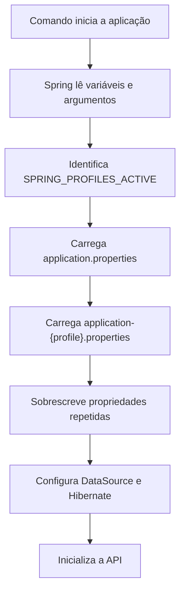

# Relatório técnico — Spring Profiles, configuração por ambiente e Docker

## 1. Identificação

- **Projeto analisado:** `study-apir`
- **Tecnologias principais:** Java, Spring Boot, Spring Data JPA, MySQL, Maven e Docker
- **Tema central:** separação de configurações por ambiente usando Spring Profiles
- **Material de referência:** [Spring Framework – Profiles para Configuração por Ambiente](https://github.com/acnaweb/java/blob/main/docs/profile.md)
- **Data da análise:** 17 de agosto de 2026

---

## 2. Objetivo deste relatório

Este relatório explica as alterações realizadas no projeto para permitir que a mesma aplicação seja executada em diferentes ambientes sem a necessidade de editar manualmente o código ou os arquivos de configuração a cada execução.

As mudanças analisadas envolvem principalmente:

- criação de configurações específicas para desenvolvimento e produção;
- uso de variáveis de ambiente para dados de conexão com o MySQL;
- seleção do ambiente por meio de um Spring Profile;
- integração do profile ativo com o Docker;
- documentação dos comandos de execução;
- criação de um script SQL com a estrutura inicial do banco;
- análise das diferenças entre desenvolvimento, produção e testes;
- identificação de pontos que ainda precisam de ajuste.

O objetivo final é obter uma aplicação configurável, portável e mais segura, na qual dados como servidor, porta, schema, usuário e senha do banco não precisem ficar fixos no código-fonte.

---

## 3. Problema que os Spring Profiles resolvem

Uma aplicação normalmente não utiliza a mesma configuração em todos os ambientes.

Por exemplo:

| Configuração | Desenvolvimento | Testes | Produção |
|---|---|---|---|
| Banco | MySQL local ou container local | Banco isolado para testes | Servidor de banco real |
| Schema | `dbdev` | `testdb` | `dbprd` |
| Exibição de SQL | Geralmente habilitada | Opcional | Geralmente desabilitada |
| Criação automática de tabelas | Pode ser permitida | Pode ser recriada a cada teste | Deve ser controlada |
| Credenciais | Podem ter valores locais padrão | Valores exclusivos de teste | Devem ser obrigatórias e secretas |

Sem profiles, seria necessário editar o mesmo `application.properties` antes de cada execução. Esse processo apresenta vários problemas:

1. aumenta o risco de executar uma configuração de desenvolvimento em produção;
2. facilita o versionamento acidental de senhas;
3. torna o deploy manual e sujeito a erros;
4. dificulta a execução da aplicação em containers;
5. mistura configurações com finalidades diferentes em um único arquivo.

Os Spring Profiles resolvem esse problema permitindo que as configurações sejam separadas por ambiente.

---

## 4. Conceito de Spring Profile

Um **profile** é um identificador de ambiente. Quando um profile é ativado, o Spring Boot carrega as configurações gerais da aplicação e, em seguida, combina essas configurações com o arquivo específico daquele profile.

A convenção de nomes é:

```text
application-{profile}.properties
```

Exemplos:

```text
application-dev.properties
application-test.properties
application-prod.properties
```

No projeto `study-apir`, foram adotados:

```text
application.properties
application-dev.properties
application-prd.properties
```

O nome `prd` foi usado para produção. Isso é válido, mas é importante manter consistência: para carregar `application-prd.properties`, o profile ativo precisa ser exatamente `prd`. Ativar `prod` não carregará o arquivo `prd`.

### 4.1 Como as configurações são combinadas

Considere:

```properties
# application.properties
server.port=9000
spring.jpa.show-sql=true
```

```properties
# application-prd.properties
server.port=8080
spring.jpa.show-sql=false
```

Quando o profile `prd` está ativo:

- `server.port` passa a valer `8080`;
- `spring.jpa.show-sql` passa a valer `false`;
- propriedades que existem apenas no arquivo base continuam disponíveis.

Portanto, o arquivo específico do profile complementa e sobrescreve as propriedades gerais.

### 4.2 Fluxo de carregamento



---

## 5. Visão geral das mudanças do projeto

| Arquivo | Tipo de mudança | Finalidade |
|---|---|---|
| `application.properties` | Atualizado | Tornar a conexão configurável por variáveis de ambiente |
| `application-dev.properties` | Criado | Definir o comportamento do ambiente de desenvolvimento |
| `application-prd.properties` | Criado | Definir o comportamento do ambiente de produção |
| `Dockerfile` | Atualizado | Definir um profile padrão e permitir troca no container |
| `README.md` | Ampliado | Documentar execução local, Docker, profiles e variáveis |
| `migration-2026-17-08.sql` | Criado | Registrar a estrutura SQL inicial das tabelas |

Essas mudanças são majoritariamente de configuração e infraestrutura. Elas não alteram diretamente as regras de negócio dos controllers, services ou repositories, mas modificam a forma como a aplicação é inicializada e conectada ao banco.

---

## 6. Atualização do `application.properties`

O `application.properties` é o arquivo base. Ele é lido independentemente do profile ativo.

### 6.1 Configurações gerais

```properties
spring.application.name=study-apir
server.port=9000
springdoc.swagger-ui.path=/
api.version=v1
```

Explicação:

- `spring.application.name`: identifica a aplicação dentro do ecossistema Spring;
- `server.port`: define a porta HTTP quando nenhum profile a sobrescreve;
- `springdoc.swagger-ui.path=/`: disponibiliza a interface do Swagger na raiz;
- `api.version=v1`: cria uma propriedade reutilizável nos mapeamentos, como `api/${api.version}/produtos`.

### 6.2 Externalização da conexão com o banco

Antes da externalização, uma configuração típica ficaria fixa:

```properties
spring.datasource.url=jdbc:mysql://localhost:3306/api
spring.datasource.username=root
spring.datasource.password=root_pwd
```

Com variáveis de ambiente, a configuração passa a ser dinâmica:

```properties
spring.datasource.url=jdbc:mysql://${DB_SERVER_URL:host.docker.internal}:${DB_SERVER_PORT:3306}/${DB_SCHEMA}?createDatabaseIfNotExist=true
spring.datasource.username=${DB_USER:root}
spring.datasource.password=${DB_PWD:password:root_pwd}
```

A sintaxe é:

```text
${NOME_DA_VARIAVEL:valor_padrao}
```

Exemplos:

- `${DB_USER:root}`: usa `DB_USER`; se não existir, usa `root`;
- `${DB_SERVER_PORT:3306}`: usa `DB_SERVER_PORT`; se não existir, usa `3306`;
- `${DB_SCHEMA}`: exige que `DB_SCHEMA` seja fornecida, pois não há valor padrão.

### 6.3 Correção necessária no estado atual

A configuração atual contém:

```properties
spring.datasource.password=${DB_PWD:password:root_pwd}
```

O primeiro `:` separa o nome da variável do valor padrão. Assim, o valor padrão efetivo se torna `password:root_pwd`, o que provavelmente não é a senha desejada.

O formato correto é:

```properties
spring.datasource.password=${DB_PWD:root_pwd}
```

Também é recomendável definir um schema padrão:

```properties
${DB_SCHEMA:study}
```

### 6.4 Configuração base recomendada

Para permitir execução direta no Windows ou Linux e execução em Docker por sobrescrita de variável:

```properties
spring.application.name=study-apir
server.port=8080
springdoc.swagger-ui.path=/
api.version=v1

spring.datasource.url=jdbc:mysql://${DB_SERVER_URL:localhost}:${DB_SERVER_PORT:3306}/${DB_SCHEMA:study}?createDatabaseIfNotExist=true&useSSL=false&allowPublicKeyRetrieval=true&serverTimezone=UTC
spring.datasource.username=${DB_USER:root}
spring.datasource.password=${DB_PWD:root_pwd}

spring.jpa.hibernate.ddl-auto=update
spring.jpa.show-sql=true
spring.jpa.database-platform=org.hibernate.dialect.MySQLDialect
```

Usar `localhost` como padrão favorece a execução da aplicação diretamente na máquina. Ao executar dentro do Docker, `DB_SERVER_URL=host.docker.internal` pode ser fornecido explicitamente.

---

## 7. Implementação do profile de desenvolvimento

O arquivo `application-dev.properties` representa o ambiente de desenvolvimento.

### 7.1 Configuração implementada

```properties
spring.application.name=study-apir
server.port=8080
springdoc.swagger-ui.path=/
api.version=v1

spring.datasource.url=jdbc:mysql://${DB_SERVER_URL:host.docker.internal}:${DB_SERVER_PORT:3306}/dbdev?createDatabaseIfNotExist=true&useSSL=false&allowPublicKeyRetrieval=true&serverTimezone=UTC
spring.datasource.username=${DB_USER:root}
spring.datasource.password=${DB_PWD:root_pwd}

spring.jpa.hibernate.ddl-auto=update
spring.jpa.show-sql=true
spring.jpa.database-platform=org.hibernate.dialect.MySQLDialect
```

### 7.2 Decisões de desenvolvimento

#### Porta 8080

O profile `dev` sobrescreve a porta base e inicia a aplicação em:

```text
http://localhost:8080
```

#### Schema `dbdev`

O banco de desenvolvimento é separado do banco de produção:

```text
dbdev
```

Isso reduz o risco de testes e alterações locais afetarem dados reais.

#### Credenciais com valores padrão

```properties
spring.datasource.username=${DB_USER:root}
spring.datasource.password=${DB_PWD:root_pwd}
```

Os padrões simplificam a execução local. Mesmo assim, é possível sobrescrevê-los por variáveis de ambiente.

#### Atualização automática do schema

```properties
spring.jpa.hibernate.ddl-auto=update
```

O Hibernate compara as entidades com o banco e tenta atualizar a estrutura necessária. Isso é conveniente durante o desenvolvimento, mas não é recomendado como estratégia principal de migração em produção.

#### Exibição do SQL

```properties
spring.jpa.show-sql=true
```

As instruções SQL aparecem no console. Isso ajuda a estudar o comportamento do JPA, investigar consultas e confirmar operações CRUD.

### 7.3 Parâmetros JDBC

| Parâmetro | Efeito |
|---|---|
| `createDatabaseIfNotExist=true` | Solicita a criação do banco se ele não existir e o usuário tiver permissão |
| `useSSL=false` | Desabilita SSL nessa conexão |
| `allowPublicKeyRetrieval=true` | Permite obter a chave pública usada por determinados métodos de autenticação do MySQL |
| `serverTimezone=UTC` | Padroniza o fuso horário da conexão como UTC |

Esses parâmetros são úteis em desenvolvimento. Em uma produção real, `useSSL=false` deve ser reavaliado, pois conexões externas normalmente devem utilizar criptografia.

---

## 8. Implementação do profile de produção

O arquivo `application-prd.properties` representa o ambiente de produção.

### 8.1 Configuração implementada

```properties
spring.application.name=study-apir
server.port=8080
springdoc.swagger-ui.path=/
api.version=v1

spring.datasource.url=jdbc:mysql://${DB_SERVER_URL}:${DB_SERVER_PORT}/${DB_SCHEMA}?useSSL=false&allowPublicKeyRetrieval=true&serverTimezone=UTC
spring.datasource.username=${DB_USER}
spring.datasource.password=${DB_PWD}

spring.jpa.hibernate.ddl-auto=none
spring.jpa.show-sql=false
spring.jpa.database-platform=org.hibernate.dialect.MySQLDialect
```

### 8.2 Variáveis obrigatórias

Neste profile, as propriedades do banco não possuem valores padrão:

```properties
${DB_SERVER_URL}
${DB_SERVER_PORT}
${DB_SCHEMA}
${DB_USER}
${DB_PWD}
```

Essa é uma decisão adequada para produção. Se uma variável crítica estiver ausente, a aplicação deve falhar na inicialização em vez de se conectar silenciosamente a um banco incorreto.

### 8.3 Controle do schema

```properties
spring.jpa.hibernate.ddl-auto=none
```

O Hibernate não cria nem altera tabelas automaticamente. Mudanças no banco precisam ser aplicadas de maneira controlada.

Vantagens:

- evita alterações inesperadas em tabelas reais;
- permite revisar scripts antes da execução;
- facilita auditoria e rollback;
- separa a evolução do banco da inicialização da aplicação.

### 8.4 SQL desabilitado no console

```properties
spring.jpa.show-sql=false
```

Em produção, isso reduz ruído nos logs e evita exposição desnecessária de detalhes das consultas.

### 8.5 Comparação entre `dev` e `prd`

| Propriedade | `dev` | `prd` |
|---|---|---|
| Porta | `8080` | `8080` |
| Schema | `dbdev` | Informado por `DB_SCHEMA` |
| Usuário padrão | `root` | Não possui |
| Senha padrão | `root_pwd` | Não possui |
| Criar banco | Permitido | Não solicitado |
| `ddl-auto` | `update` | `none` |
| Mostrar SQL | `true` | `false` |

---

## 9. Profile de testes: previsto no material, ainda não implementado

O material de referência também apresenta o arquivo:

```text
application-test.properties
```

O projeto atualmente possui um teste com `@SpringBootTest`, mas não possui uma configuração exclusiva para testes.

Consequência: o teste `contextLoads()` tenta inicializar o contexto usando a configuração base e acessar o MySQL configurado nela.

Na validação do estado atual, o teste falhou com:

```text
UnknownHostException: host.docker.internal
```

Isso ocorre porque `host.docker.internal` foi utilizado fora do container e não pôde ser resolvido naquele contexto.

### 9.1 Possível configuração de teste

Uma evolução seria criar:

```text
src/test/resources/application-test.properties
```

E ativar o profile no teste:

```java
@ActiveProfiles("test")
@SpringBootTest
class StudyApirApplicationTests {
    @Test
    void contextLoads() {
    }
}
```

O banco de teste pode ser:

- uma instância MySQL exclusiva;
- um container criado por Testcontainers;
- um banco em memória compatível com os testes, quando adequado.

Essa melhoria não faz parte da implementação atual, mas segue diretamente a separação de ambientes ensinada no material.

---

## 10. Variáveis de ambiente

Variáveis de ambiente permitem fornecer configurações fora do código e da imagem Docker.

### 10.1 Variáveis utilizadas

| Variável | Responsabilidade | Exemplo de desenvolvimento | Produção |
|---|---|---|---|
| `DB_SERVER_URL` | Host do MySQL | `localhost` ou `host.docker.internal` | Obrigatória |
| `DB_SERVER_PORT` | Porta do MySQL | `3306` | Obrigatória |
| `DB_SCHEMA` | Nome do banco/schema | `dbdev` ou `db_api` | Obrigatória |
| `DB_USER` | Usuário do banco | `root` | Obrigatória |
| `DB_PWD` | Senha do banco | `root_pwd` | Obrigatória |
| `SPRING_PROFILES_ACTIVE` | Profile que será carregado | `dev` | `prd` |

### 10.2 PowerShell

```powershell
$env:DB_SERVER_URL="localhost"
$env:DB_SERVER_PORT="3306"
$env:DB_SCHEMA="dbdev"
$env:DB_USER="root"
$env:DB_PWD="root_pwd"
$env:SPRING_PROFILES_ACTIVE="dev"
```

As variáveis definidas dessa forma valem para a sessão atual do PowerShell e para processos iniciados por ela.

Para remover uma variável da sessão:

```powershell
Remove-Item Env:DB_PWD
```

### 10.3 Git Bash, Linux e macOS

```bash
export DB_SERVER_URL=localhost
export DB_SERVER_PORT=3306
export DB_SCHEMA=dbdev
export DB_USER=root
export DB_PWD=root_pwd
export SPRING_PROFILES_ACTIVE=dev
```

Para remover uma variável:

```bash
unset DB_PWD
```

### 10.4 Valores padrão e obrigatórios

Com padrão:

```properties
spring.datasource.username=${DB_USER:root}
```

Sem padrão:

```properties
spring.datasource.username=${DB_USER}
```

No segundo caso, a inicialização falha se `DB_USER` não estiver disponível. Esse comportamento é desejável para informações obrigatórias de produção.

---

## 11. Formas de ativar um profile

### 11.1 Variável de ambiente

```powershell
$env:SPRING_PROFILES_ACTIVE="dev"
```

```bash
export SPRING_PROFILES_ACTIVE=dev
```

Essa é a forma mais conveniente em containers e pipelines.

### 11.2 Maven

No Windows:

```powershell
.\mvnw.cmd spring-boot:run "-Dspring-boot.run.profiles=dev"
```

No Git Bash, Linux ou macOS:

```bash
./mvnw spring-boot:run -Dspring-boot.run.profiles=dev
```

### 11.3 Parâmetro da JVM

```bash
java -Dspring.profiles.active=dev -jar target/app.jar
```

### 11.4 Argumento da aplicação

```bash
java -jar target/app.jar --spring.profiles.active=dev
```

### 11.5 Pelo arquivo base

```properties
spring.profiles.active=dev
```

Essa alternativa deixa um profile fixo no código-fonte. Para Docker e deploys, normalmente é mais flexível escolher o profile externamente.

---

## 12. Atualizações no Dockerfile

### 12.1 Build multi-stage

O projeto usa duas etapas:

```dockerfile
FROM maven:3.9.8-eclipse-temurin-21 AS build
WORKDIR /opt/app
COPY . .
RUN mvn clean package -DskipTests

FROM eclipse-temurin:21-alpine-3.21
WORKDIR /opt/app
COPY --from=build /opt/app/target/app.jar /opt/app/app.jar
```

#### Primeira etapa: build

- contém Maven e JDK;
- copia o código-fonte;
- executa o empacotamento;
- gera `/opt/app/target/app.jar`.

#### Segunda etapa: runtime

- utiliza uma imagem menor baseada em Alpine;
- recebe apenas o JAR gerado;
- não carrega o Maven nem o código-fonte completo na imagem final.

Essa estratégia reduz o tamanho e a superfície da imagem de execução.

### 12.2 Profile padrão do container

A atualização adicionou:

```dockerfile
ENV SPRING_PROFILES_ACTIVE=dev
```

Isso define `dev` como valor padrão. O valor pode ser sobrescrito ao iniciar o container:

```bash
docker run -e SPRING_PROFILES_ACTIVE=prd study-api:1.1
```

### 12.3 Comando de inicialização

O estado atual contém:

```dockerfile
CMD ["java", "-Dspring.profiles.active=${SPRING_PROFILES_ACTIVE}", "-jar", "app.jar"]
```

Na forma JSON de `CMD`, não há um shell fazendo expansão comum de `$VAR`. Além disso, o Spring Boot já reconhece diretamente a variável `SPRING_PROFILES_ACTIVE`.

Uma forma mais simples e previsível é:

```dockerfile
ENV SPRING_PROFILES_ACTIVE=dev
CMD ["java", "-jar", "app.jar"]
```

O processo Java recebe a variável de ambiente e o Spring seleciona o profile correspondente.

### 12.4 Java 17 e Java 21

O `pom.xml` declara:

```xml
<java.version>17</java.version>
```

O Dockerfile atual utiliza Java 21. Um runtime Java 21 consegue executar bytecode compilado para Java 17, portanto isso é tecnicamente válido. Entretanto, alinhar build e runtime com a versão declarada no projeto reduz diferenças entre os ambientes.

---

## 13. Construção e execução com Docker

### 13.1 Construir a imagem

```bash
docker build -t study-api:1.1 .
```

Significado:

- `docker build`: inicia a construção;
- `-t study-api:1.1`: define nome e versão da imagem;
- `.`: utiliza o diretório atual como contexto.

### 13.2 Executar com profile de produção

```bash
docker run \
  -p 8080:8080 \
  -e DB_SERVER_URL=host.docker.internal \
  -e DB_SERVER_PORT=3306 \
  -e DB_SCHEMA=db_api \
  -e DB_USER=root \
  -e DB_PWD=root_pwd \
  -e SPRING_PROFILES_ACTIVE=prd \
  study-api:1.1
```

Explicação:

| Parte | Função |
|---|---|
| `docker run` | Cria e inicia um container |
| `-p 8080:8080` | Liga a porta 8080 do Windows à porta 8080 do container |
| `-e NOME=valor` | Define uma variável dentro do container |
| `host.docker.internal` | Permite que o container acesse um serviço no host |
| `study-api:1.1` | Imagem utilizada |

### 13.3 Por que `localhost` muda dentro do container

Dentro de um container, `localhost` aponta para o próprio container. Se o MySQL está instalado no Windows e a API está em Docker, `localhost` não representa o Windows.

Nesse cenário:

```text
API dentro do container -> host.docker.internal:3306 -> MySQL no Windows
```

Se API e MySQL estiverem em containers diferentes, o ideal é utilizar uma rede Docker e acessar o banco pelo nome do serviço ou container.

### 13.4 Uso de arquivo `.env`

As variáveis podem ser agrupadas:

```env
DB_SERVER_URL=host.docker.internal
DB_SERVER_PORT=3306
DB_SCHEMA=db_api
DB_USER=root
DB_PWD=root_pwd
SPRING_PROFILES_ACTIVE=prd
```

E carregadas por:

```bash
docker run --env-file .env -p 8080:8080 study-api:1.1
```

O `.env` com dados reais não deve ser versionado.

---

## 14. Atualização do README

O README deixou de conter apenas um comando Maven e passou a documentar:

- pré-requisitos;
- variáveis de ambiente;
- comandos para Linux, macOS e PowerShell;
- execução local com Maven e Maven Wrapper;
- criação da imagem Docker;
- execução do container;
- seleção dos profiles `dev` e `prd`;
- comandos para listar, parar e remover containers;
- comandos para listar e remover imagens;
- recomendações sobre `.env` e credenciais.

Essa atualização é importante porque transforma conhecimento que antes dependia da memória do desenvolvedor em um procedimento reproduzível.

Um novo integrante consegue identificar:

1. quais ferramentas instalar;
2. quais variáveis definir;
3. qual comando executar;
4. em qual porta acessar a API;
5. como conectar o container ao MySQL;
6. como evitar o versionamento de credenciais.

---

## 15. Script `migration-2026-17-08.sql`

O script cria:

- tabela `clientes`;
- tabela `produtos`;
- tabela `produtos_seq`;
- valor inicial da sequência de produtos.

### 15.1 Tabela `clientes`

```sql
create table clientes (
    id bigint not null,
    nome_cliente char(100) not null,
    primary key (id)
) engine = InnoDB;
```

Ela corresponde à entidade `Cliente`, inclusive ao nome de coluna `nome_cliente`.

### 15.2 Tabela `produtos`

```sql
create table produtos (
    id bigint not null,
    nome varchar(255),
    valor decimal(38, 2),
    primary key (id)
) engine = InnoDB;
```

O tipo `decimal(38, 2)` é apropriado para o `BigDecimal` utilizado na entidade Java, pois evita imprecisões típicas de `float` e `double` para valores monetários.

### 15.3 Sequence simulada em tabela

```sql
create table produtos_seq (next_val bigint) engine = InnoDB;
insert into produtos_seq (next_val) values (1);
```

Essa tabela dá suporte à estratégia de geração de identificadores utilizada pelo Hibernate.

### 15.4 Execução do arquivo

O nome `migration-2026-17-08.sql` não segue automaticamente as convenções do Flyway nem o nome padrão `schema.sql` do Spring Boot. Portanto, apenas colocar esse arquivo em `src/main/resources` não garante sua execução.

Ele pode ser:

- executado manualmente no MySQL;
- renomeado e integrado ao mecanismo de inicialização do Spring;
- movido para uma estrutura do Flyway, como `db/migration/V1__estrutura_inicial.sql`, após adicionar a dependência necessária;
- gerenciado por Liquibase.

No profile `prd`, como `ddl-auto=none`, alguma estratégia externa de migração é necessária para criar e evoluir o banco.

---

## 16. Uso de `@Profile` no código Java

O material também apresenta `@Profile`, que permite carregar implementações Java diferentes conforme o ambiente.

Exemplo conceitual:

```java
@Profile("dev")
@Service
public class DevEmailService implements EmailService {
    public void send(String mensagem) {
        System.out.println("Simulação de e-mail: " + mensagem);
    }
}
```

```java
@Profile("prd")
@Service
public class ProdEmailService implements EmailService {
    public void send(String mensagem) {
        // Integração real com o provedor de e-mail
    }
}
```

Assim, o restante da aplicação depende apenas de `EmailService`, enquanto o Spring escolhe a implementação correta.

O projeto atual utiliza profiles nos arquivos de propriedades, mas ainda não utiliza `@Profile` em classes. Isso não é um erro: a anotação só é necessária quando o comportamento dos beans também precisa variar.

Casos possíveis no projeto:

- repository em memória somente em desenvolvimento;
- integração externa simulada em testes;
- serviço real de e-mail somente em produção;
- carga de dados iniciais apenas no profile `dev`.

---

## 17. Verificação do profile ativo

O profile pode ser consultado programaticamente:

```java
@Autowired
private Environment environment;

public void logProfile() {
    System.out.println(
        "Profiles ativos: " +
        Arrays.toString(environment.getActiveProfiles())
    );
}
```

Outras formas de verificar:

1. observar a inicialização do Spring no console;
2. conferir `SPRING_PROFILES_ACTIVE` antes de iniciar;
3. habilitar o Actuator e consultar o ambiente com os devidos controles de segurança;
4. registrar o profile ativo em um componente de inicialização.

Não é recomendado expor publicamente credenciais ou todas as propriedades do ambiente em um endpoint.

---

## 18. Segurança das configurações

### 18.1 O que não deve ser versionado

- senhas reais;
- tokens;
- chaves de API;
- strings de conexão contendo credenciais;
- certificados privados;
- arquivos `.env` reais.

### 18.2 Arquivo `.env.example`

Um modelo pode ser versionado sem valores sensíveis:

```env
DB_SERVER_URL=localhost
DB_SERVER_PORT=3306
DB_SCHEMA=nome_do_schema
DB_USER=usuario
DB_PWD=senha
SPRING_PROFILES_ACTIVE=dev
```

### 18.3 Situação atual do `.gitignore`

O README recomenda ignorar `.env`, mas o `.gitignore` atual ainda não contém essa entrada.

Deve ser acrescentado:

```gitignore
.env
```

Essa é uma atualização recomendada e ainda não implementada.

### 18.4 Produção

Em um ambiente real, variáveis de ambiente são melhores do que senhas dentro do Git, mas ainda podem não ser suficientes para todos os requisitos de segurança. Alternativas incluem:

- Docker Secrets;
- Kubernetes Secrets;
- HashiCorp Vault;
- Spring Cloud Config com proteção apropriada;
- gerenciadores de segredo do provedor de nuvem.

---

## 19. Ordem de prioridade das configurações

O Spring Boot possui uma hierarquia de fontes. De forma simplificada, configurações fornecidas externamente costumam poder sobrescrever as configurações empacotadas na aplicação.

Exemplo prático:

1. `application.properties` define valores gerais;
2. `application-dev.properties` sobrescreve valores quando `dev` está ativo;
3. variáveis de ambiente podem fornecer valores externos;
4. argumentos da linha de comando podem sobrescrever valores anteriores.

Isso explica por que a imagem pode ter:

```dockerfile
ENV SPRING_PROFILES_ACTIVE=dev
```

e ainda ser iniciada em produção com:

```bash
docker run -e SPRING_PROFILES_ACTIVE=prd study-api:1.1
```

O valor informado no `docker run` substitui o padrão declarado na imagem.

---

## 20. Procedimentos de execução

### 20.1 Aplicação no Windows e MySQL no Windows

```powershell
$env:DB_SERVER_URL="localhost"
$env:DB_SERVER_PORT="3306"
$env:DB_SCHEMA="dbdev"
$env:DB_USER="root"
$env:DB_PWD="root_pwd"
$env:SPRING_PROFILES_ACTIVE="dev"
.\mvnw.cmd spring-boot:run
```

### 20.2 Aplicação em Docker e MySQL no Windows

```bash
docker build -t study-api:1.1 .

docker run --name study-api \
  -p 8080:8080 \
  -e DB_SERVER_URL=host.docker.internal \
  -e DB_SERVER_PORT=3306 \
  -e DB_SCHEMA=dbdev \
  -e DB_USER=root \
  -e DB_PWD=root_pwd \
  -e SPRING_PROFILES_ACTIVE=dev \
  study-api:1.1
```

### 20.3 Produção

```bash
docker run --name study-api \
  -p 8080:8080 \
  -e DB_SERVER_URL=<servidor-do-mysql> \
  -e DB_SERVER_PORT=3306 \
  -e DB_SCHEMA=<schema-de-producao> \
  -e DB_USER=<usuario-de-producao> \
  -e DB_PWD=<segredo> \
  -e SPRING_PROFILES_ACTIVE=prd \
  study-api:1.1
```

Em produção, os valores sensíveis devem vir do mecanismo de segredos da plataforma, não de um comando armazenado no histórico do shell.

---

## 21. Problemas comuns e diagnóstico

### 21.1 Profile não foi carregado

Verificar:

```powershell
$env:SPRING_PROFILES_ACTIVE
```

```bash
echo "$SPRING_PROFILES_ACTIVE"
```

Confirmar também se o valor corresponde ao nome do arquivo:

```text
prd -> application-prd.properties
dev -> application-dev.properties
```

### 21.2 Placeholder sem valor

Erro possível:

```text
Could not resolve placeholder 'DB_SCHEMA'
```

Causa: uma propriedade como `${DB_SCHEMA}` não recebeu variável e não possui valor padrão.

### 21.3 Falha de conexão com MySQL

Verificar:

- se o MySQL está iniciado;
- se a porta `3306` está disponível;
- se o usuário e a senha estão corretos;
- se o schema existe ou pode ser criado;
- se `localhost` ou `host.docker.internal` é apropriado para o local onde a API executa.

### 21.4 `UnknownHostException: host.docker.internal`

Esse endereço deve ser usado principalmente de dentro do Docker Desktop para acessar o host. Na execução direta da aplicação, prefira:

```text
DB_SERVER_URL=localhost
```

### 21.5 Porta diferente da documentação

O arquivo base atual usa `9000`, enquanto `dev`, `prd` e README usam `8080`. Sem profile ativo, a aplicação inicia em `9000`; com `dev` ou `prd`, inicia em `8080`.

Para evitar confusão, é recomendável padronizar a porta ou documentar explicitamente a diferença.

### 21.6 Docker não inicia

Se o Docker Desktop informar que a virtualização não foi detectada:

- habilitar Intel VT-x/VMX ou AMD-V/SVM na BIOS/UEFI;
- habilitar WSL e Virtual Machine Platform no Windows;
- reiniciar o Windows;
- confirmar que o WSL 2 consegue iniciar;
- testar com `docker info`.

Esse problema é de infraestrutura e ocorre antes da criação do container Java ou MySQL.

---

## 22. Validações realizadas

### 22.1 Empacotamento

Comando equivalente ao utilizado no Dockerfile:

```powershell
.\mvnw.cmd -DskipTests package
```

Resultado observado:

```text
PACKAGE_OK
```

Isso confirma que o código Java compila e que o JAR pode ser criado quando os testes são ignorados.

### 22.2 Teste automatizado

Comando:

```powershell
.\mvnw.cmd test
```

Resultado observado:

```text
Tests run: 1, Failures: 0, Errors: 1
UnknownHostException: host.docker.internal
```

O erro não é uma falha de compilação. O contexto do Spring tenta configurar JPA e acessar o banco, mas o host padrão não é resolvido durante o teste local.

### 22.3 Consequência do `-DskipTests`

O Dockerfile utiliza:

```dockerfile
RUN mvn clean package -DskipTests
```

Isso permite construir a imagem mesmo com o teste falhando. É útil temporariamente, mas não deve substituir a correção da configuração de testes em um fluxo de integração contínua.

---

## 23. Melhorias recomendadas

### Prioridade alta

1. corrigir `${DB_PWD:password:root_pwd}` para `${DB_PWD:root_pwd}`;
2. decidir se o host padrão será `localhost` ou `host.docker.internal`;
3. configurar um profile exclusivo para testes;
4. garantir uma estratégia real de migração para o profile `prd`;
5. adicionar `.env` ao `.gitignore`.

### Prioridade média

1. padronizar a porta base e as portas dos profiles;
2. simplificar o `CMD` do Dockerfile;
3. alinhar a versão Java do Dockerfile com o `pom.xml`;
4. definir um valor padrão coerente para `DB_SCHEMA` no ambiente local;
5. padronizar o nome da aplicação como `study-apir` ou `study-api`.

### Evoluções futuras

1. utilizar Docker Compose para iniciar API e MySQL juntos;
2. adotar Flyway ou Liquibase;
3. utilizar Testcontainers nos testes de integração;
4. usar `@Profile` para serviços específicos por ambiente;
5. armazenar segredos em um cofre de credenciais;
6. adicionar health checks para API e banco;
7. validar as variáveis obrigatórias no início da aplicação.

---

## 24. Comparação resumida: antes e depois

| Aspecto | Antes | Depois |
|---|---|---|
| Configuração de banco | Centralizada em um único arquivo | Separada por ambiente |
| Credenciais | Dependentes de valores fixos | Fornecidas por variáveis |
| Desenvolvimento | Sem profile dedicado | `application-dev.properties` |
| Produção | Sem proteção específica | `ddl-auto=none` e SQL oculto |
| Docker | Executava apenas o JAR | Recebe profile por ambiente |
| Documentação | Apenas comando Maven | Guia de execução completo |
| Banco | Estrutura dependente do Hibernate | Script SQL inicial registrado |
| Testes | Dependem da configuração geral | Ainda precisam de profile próprio |

---

## 25. Glossário

| Termo | Definição |
|---|---|
| Profile | Conjunto de configurações ou beans ativados para determinado ambiente |
| DataSource | Componente que gerencia conexões com o banco |
| JPA | Especificação Java para persistência de dados relacionais |
| Hibernate | Implementação de JPA utilizada pelo Spring Boot |
| JDBC URL | Endereço que descreve como conectar ao banco |
| Schema | Estrutura lógica que contém tabelas e outros objetos do banco |
| Variável de ambiente | Valor fornecido externamente ao processo |
| Placeholder | Expressão como `${DB_USER}` substituída durante a configuração |
| Docker image | Pacote imutável usado para criar containers |
| Container | Processo isolado criado a partir de uma imagem |
| Migration | Alteração versionada na estrutura do banco |
| Bean | Objeto criado e gerenciado pelo contêiner do Spring |

---

## 26. Conclusão

A implementação de Spring Profiles tornou o projeto mais preparado para diferentes ambientes. As principais evoluções foram a criação dos profiles `dev` e `prd`, a externalização dos dados de conexão, a integração com Docker e a ampliação da documentação operacional.

O profile de desenvolvimento prioriza facilidade de uso e diagnóstico: possui credenciais padrão, permite atualização automática do schema e exibe SQL. O profile de produção exige configuração externa e impede alterações automáticas do Hibernate, reduzindo o risco operacional.

A solução ainda precisa de ajustes para ficar consistente em todos os cenários. Os pontos principais são corrigir a senha padrão do arquivo base, padronizar host e porta, adicionar um profile de testes, proteger `.env` e adotar um mecanismo efetivo de migração.

Com essas correções, o projeto terá uma separação clara entre código e configuração, builds mais reproduzíveis e um caminho mais seguro do desenvolvimento até a produção.

---

## 27. Referências

- [Material do professor — Spring Profiles para Configuração por Ambiente](https://github.com/acnaweb/java/blob/main/docs/profile.md)
- [Spring Boot — Profiles](https://docs.spring.io/spring-boot/reference/features/profiles.html)
- [Spring Boot — Externalized Configuration](https://docs.spring.io/spring-boot/reference/features/external-config.html)
- [Docker — Variáveis no Dockerfile](https://docs.docker.com/reference/dockerfile/#environment-replacement)
- Arquivos locais analisados: `application.properties`, `application-dev.properties`, `application-prd.properties`, `Dockerfile`, `README.md`, `pom.xml`, `migration-2026-17-08.sql` e `StudyApirApplicationTests.java`.
